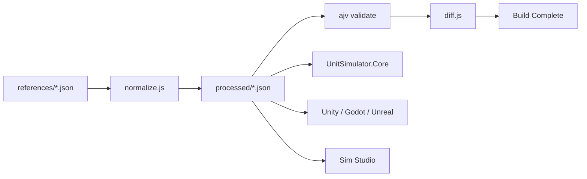

# Development Milestone

RTS 게임 코어 완성 및 게임 엔진 통합을 위한 개발 마일스톤 문서.

---

## 목차

1. [프로젝트 개요](#1-프로젝트-개요)
2. [현재 상태](#2-현재-상태)
3. [마일스톤 개요](#3-마일스톤-개요)
4. [Phase 1: 코어 분리 및 안정화](#4-phase-1-코어-분리-및-안정화)
5. [Phase 2: 데이터 파이프라인 정규화](#5-phase-2-데이터-파이프라인-정규화)
6. [Phase 3: 게임 엔진 선정 및 어댑터 개발](#6-phase-3-게임-엔진-선정-및-어댑터-개발)
7. [Phase 4: 게임 프로토타입](#7-phase-4-게임-프로토타입)
8. [Phase 5: 릴리즈 준비](#8-phase-5-릴리즈-준비)
9. [분산 작업 가이드](#9-분산-작업-가이드)

---

## 1. 프로젝트 개요

### 1.1 목표

- RTS 게임의 핵심 시뮬레이션 코어 완성
- 게임 엔진(Unity/Godot/Unreal 중 택1) 통합
- 데이터 드리븐 밸런싱 시스템 구축
- 최종 게임 릴리즈

### 1.2 핵심 원칙

| 원칙 | 설명 |
|------|------|
| **Deterministic** | 동일 입력 → 동일 결과. 리플레이/네트워크 동기화 필수 조건 |
| **Engine Agnostic** | 코어는 렌더링/입력/사운드 의존성 없음 |
| **Data-Driven** | 코드 수정 없이 밸런스 조정 가능 |
| **Command Pattern** | 모든 게임 액션은 직렬화 가능한 커맨드 |
| **Testable** | 모든 모듈은 독립적으로 테스트 가능 |

---

## 2. 현재 상태

### 2.1 솔루션 구조

```
unit-simulator/
├── UnitSimulator.Core/    # 순수 시뮬레이션 코어
│   ├── SimulatorCore.cs   # 핵심 시뮬레이션 엔진
│   ├── Unit.cs            # 유닛 상태/행동
│   ├── Behaviors/         # Squad/Enemy AI
│   └── Commands/          # Command Queue 구조
│
├── UnitSimulator.Server/  # 개발 서버/렌더링
│   ├── WaveManager.cs     # 웨이브 명령 생성
│   ├── Renderer.cs        # ImageSharp 렌더링
│   ├── WebSocketServer.cs # 개발용 서버
│   └── Session*.cs        # 멀티세션 지원
│
├── ReferenceModels/       # 데이터 드리븐 모듈
│   └── (Google Sheets 연동)
│
├── sim-studio/            # React 기반 개발 도구
│   └── (시뮬레이션 시각화/디버깅)
│
├── dev-tool/              # 개발 인프라
└── docs/                  # 문서
```

### 2.2 완료된 기능

- [x] 유닛 이동/전투 시뮬레이션
- [x] 웨이브 기반 적 스폰
- [x] 프레임 기반 상태 관리
- [x] WebSocket 실시간 통신
- [x] 멀티세션 지원
- [x] 세션별 output 격리
- [x] GUI 시각화 도구
- [x] 코어/서버 분리 (M1.1)
- [x] 렌더링 의존성 제거 (M1.2)
- [x] 인터페이스 계약 정의 (M1.3)
- [x] 유닛 테스트 구축 (M1.4)
- [x] Reference 시스템 구현 (데이터 드리븐 유닛 로딩)

### 2.3 미완료/개선 필요

- [ ] 데이터 스키마 표준화 (JSON Schema)
- [ ] 게임 엔진 통합

---

## 3. 마일스톤 개요

```
Phase 1          Phase 2          Phase 3          Phase 4          Phase 5
코어 분리    →   데이터 정규화  →  엔진 통합    →   프로토타입   →   릴리즈
(2-3주)          (1-2주)          (3-4주)          (4-6주)          (2-3주)
   │                │                │                │                │
   ├─ M1.1          ├─ M2.1          ├─ M3.1          ├─ M4.1          ├─ M5.1
   ├─ M1.2          ├─ M2.2          ├─ M3.2          ├─ M4.2          ├─ M5.2
   ├─ M1.3          └─ M2.3          ├─ M3.3          ├─ M4.3          └─ M5.3
   └─ M1.4                           └─ M3.4          └─ M4.4
```

---

## 4. Phase 1: 코어 분리 및 안정화

**목표**: 게임 엔진 독립적인 순수 시뮬레이션 라이브러리 추출

### M1.1: 프로젝트 구조 재편

**담당**: 인프라/아키텍처

**작업 내용**:

#### 현재 파일 분석 결과

| 파일 | 목표 프로젝트 | 의존성 | 비고 |
|------|--------------|--------|------|
| `Unit.cs` | Core | System.Numerics, Constants | UnitRole, UnitFaction enum 포함 |
| `FrameData.cs` | Core | System.Text.Json, Unit, WaveManager | SerializableVector2, UnitStateData 포함 |
| `ISimulatorCallbacks.cs` | Core | System.Numerics | UnitEventData, UnitEventType, DefaultSimulatorCallbacks 포함 |
| `SimulatorCore.cs` | Core | Unit, WaveManager, **Renderer** | ⚠️ Renderer 의존성 제거 필요 (M1.2 선행 또는 동시 진행) |
| `AvoidanceSystem.cs` | Core | Unit, Constants, MathUtils | 순수 로직 |
| `MathUtils.cs` | Core | Unit, Constants | 순수 로직 |
| `SquadBehavior.cs` | Core | Unit, Constants, MathUtils, AvoidanceSystem | 순수 로직 |
| `EnemyBehavior.cs` | Core | Unit, Constants, MathUtils, AvoidanceSystem | 순수 로직 |
| `WaveManager.cs` | **분리 필요** | Constants, Unit | WaveManager(Server, 명령 생성) + Renderer(Server) 분리 |
| `Constants.cs` | **분리 필요** | 없음 | 게임 상수(Core) + 인프라 상수(Server) 혼재 |
| `GuiIntegration.cs` | Core | SimulatorCore, FrameData, ISimulatorCallbacks | 인터페이스/통합 레이어 |
| `WebSocketServer.cs` | Server | System.Net.WebSockets, SessionManager | 네트워킹 인프라 |
| `SessionManager.cs` | Server | SimulationSession, SessionClient | 세션 관리 |
| `SessionClient.cs` | Server | System.Net.WebSockets | 클라이언트 표현 |
| `SessionLogger.cs` | Server | FrameData, ISimulatorCallbacks, System.Text.Json | 로깅 인프라 |
| `SimulationSession.cs` | Server | SimulatorCore, SessionClient, WebSocket | 세션 격리 |
| `Program.cs` | Server | 전체 | 진입점 |

#### 주요 분리 작업

**1. WaveManager.cs 파일 분리**
```csharp
// WaveManager.cs → Core로 이동 (웨이브 로직만)
public class WaveManager { ... }

// Renderer.cs → Server로 이동 (ImageSharp 의존)
public class Renderer { ... }
```

**2. Constants.cs 분리**
```csharp
// Constants.cs (Core) - 게임 로직 상수
public static class GameConstants
{
    public const float UNIT_RADIUS = 20f;
    public const int FRIENDLY_HP = 100;
    public const float ATTACK_COOLDOWN = 30f;
    // ... 게임 밸런스 관련
}

// ServerConstants.cs (Server) - 인프라 상수
public static class ServerConstants
{
    public const int IMAGE_WIDTH = 2000;
    public const int IMAGE_HEIGHT = 1000;
    public const string OUTPUT_DIRECTORY = "output";
    // ... 렌더링/출력 관련
}
```

**3. SimulatorCore 렌더링 의존성 제거**
```csharp
// 현재: SimulatorCore가 Renderer를 직접 생성
private Renderer? _renderer;
_renderer = new Renderer(_outputDirectory);

// 목표: 렌더링을 외부에서 주입하거나 콜백으로 처리
public interface IFrameRenderer
{
    void RenderFrame(FrameData frameData);
}
```

**4. FrameData의 WaveManager 의존성 제거**

`FrameData.FromSimulationState()`가 WaveManager를 파라미터로 받고 있어 분리 시 문제 발생.

```csharp
// 현재 (Core가 Server 타입에 의존)
public static FrameData FromSimulationState(
    int frameNumber,
    List<Unit> friendlies,
    List<Unit> enemies,
    Vector2 mainTarget,
    WaveManager waveManager)  // ❌ Server 타입
{
    CurrentWave = waveManager.CurrentWave,
    AllWavesCleared = !waveManager.HasMoreWaves && ...
}

// 변경 후 (값만 전달)
public static FrameData FromSimulationState(
    int frameNumber,
    List<Unit> friendlies,
    List<Unit> enemies,
    Vector2 mainTarget,
    int currentWave,          // ✅ 값만 전달
    bool hasMoreWaves)        // ✅ 값만 전달
{
    CurrentWave = currentWave,
    AllWavesCleared = !hasMoreWaves && ...
}
```

**5. Command Queue 기반 유닛 생성 구조**

현재 SimulatorCore가 WaveManager를 직접 호출하여 유닛을 생성하는 구조를
외부에서 명령을 주입받는 구조로 변경.

```
┌─────────────────────────────────────────────────────────────┐
│                        Server                                │
│  ┌─────────────┐    ┌──────────────────┐                    │
│  │ WaveManager │───►│ SpawnUnitCommand │──┐                 │
│  │ (웨이브 로직) │    │ MoveUnitCommand  │  │                 │
│  └─────────────┘    │ DamageCommand    │  │                 │
│                     └──────────────────┘  │                 │
└───────────────────────────────────────────│─────────────────┘
                                            ▼
                                    ┌───────────────┐
                                    │ Command Queue │
                                    └───────┬───────┘
                                            │
┌───────────────────────────────────────────│─────────────────┐
│                        Core               ▼                  │
│  ┌────────────────────────────────────────────────┐         │
│  │              SimulatorCore                      │         │
│  │  ┌──────────────────┐   ┌──────────────────┐   │         │
│  │  │ CommandProcessor │──►│ Unit Management  │   │         │
│  │  │  (명령 컨슘)      │   │  (상태 변경)      │   │         │
│  │  └──────────────────┘   └──────────────────┘   │         │
│  └────────────────────────────────────────────────┘         │
└─────────────────────────────────────────────────────────────┘
```

```csharp
// ============ Core ============

// 명령 인터페이스 (직렬화 가능, 리플레이 지원)
public interface ISimulationCommand
{
    int FrameNumber { get; }  // 실행될 프레임
}

public record SpawnUnitCommand(
    int FrameNumber,
    Vector2 Position,
    UnitRole Role,
    UnitFaction Faction,
    int? HP = null
) : ISimulationCommand;

// SimulatorCore - 명령 큐 처리
public class SimulatorCore
{
    private readonly Queue<ISimulationCommand> _commandQueue = new();

    public void EnqueueCommand(ISimulationCommand command)
        => _commandQueue.Enqueue(command);

    public void EnqueueCommands(IEnumerable<ISimulationCommand> commands)
    {
        foreach (var cmd in commands) _commandQueue.Enqueue(cmd);
    }

    public FrameData Step(ISimulatorCallbacks? callbacks = null)
    {
        ProcessCommands(_currentFrame, callbacks);  // 명령 먼저 처리
        // ... 기존 시뮬레이션 로직
    }
}

// ============ Server ============

// WaveManager는 명령 생성만 담당
public class WaveManager
{
    public IEnumerable<SpawnUnitCommand> GetWaveCommands(int waveNumber, int frameNumber)
    {
        return _waveSpawns[waveNumber].Select(pos => new SpawnUnitCommand(
            FrameNumber: frameNumber,
            Position: pos,
            Role: UnitRole.Melee,
            Faction: UnitFaction.Enemy
        ));
    }
}
```

**장점**:
- Core가 WaveManager에 의존하지 않음 (역전)
- 모든 명령이 직렬화 가능 → 리플레이/네트워크 동기화
- Determinism 보장: 동일 명령 시퀀스 = 동일 결과
- Core 단독 테스트 가능 (명령 주입)

#### 목표 구조

```
[현재]                              [목표]
UnitMove/                           UnitSimulator.Core/
├── SimulatorCore.cs                ├── SimulatorCore.cs (Renderer, WaveManager 제거)
├── Unit.cs                         ├── Unit.cs (UnitRole, UnitFaction 포함)
├── FrameData.cs                    ├── FrameData.cs
├── ISimulatorCallbacks.cs          ├── ISimulatorCallbacks.cs
├── WaveManager.cs ─┐               ├── Commands/
├── AvoidanceSystem.cs              │   ├── ISimulationCommand.cs
├── MathUtils.cs                    │   ├── SpawnUnitCommand.cs
├── SquadBehavior.cs                │   └── CommandProcessor.cs
├── EnemyBehavior.cs                ├── AvoidanceSystem.cs
├── Constants.cs ───┤               ├── MathUtils.cs
├── GuiIntegration.cs               ├── SquadBehavior.cs
│                   │               ├── EnemyBehavior.cs
│                   │               ├── GameConstants.cs
│                   │               └── GuiIntegration.cs
│                   │
├── WebSocketServer.cs              UnitSimulator.Server/
├── SessionManager.cs               ├── WebSocketServer.cs
├── SessionClient.cs                ├── SessionManager.cs
├── SessionLogger.cs                ├── SessionClient.cs
├── SimulationSession.cs            ├── SessionLogger.cs
└── Program.cs      │               ├── SimulationSession.cs
                    │               ├── Program.cs
                    │               ├── WaveManager.cs (명령 생성만)
                    └───────────────├── Renderer.cs (WaveManager에서 분리)
                                    └── ServerConstants.cs
```

#### 프로젝트 생성 가이드

**1. 솔루션 및 프로젝트 생성**
```bash
# 솔루션 생성 (기존 UnitMove.sln 대체 또는 병행)
dotnet new sln -n UnitSimulator

# Core 프로젝트 (클래스 라이브러리)
dotnet new classlib -n UnitSimulator.Core -o UnitSimulator.Core
dotnet sln add UnitSimulator.Core

# Server 프로젝트 (콘솔 앱)
dotnet new console -n UnitSimulator.Server -o UnitSimulator.Server
dotnet sln add UnitSimulator.Server

# Server → Core 참조 추가
dotnet add UnitSimulator.Server reference UnitSimulator.Core
```

**2. Core csproj 설정**
```xml
<Project Sdk="Microsoft.NET.Sdk">
  <PropertyGroup>
    <TargetFramework>net10.0</TargetFramework>
    <ImplicitUsings>enable</ImplicitUsings>
    <Nullable>enable</Nullable>
    <RootNamespace>UnitSimulator.Core</RootNamespace>
  </PropertyGroup>
  <!-- 외부 패키지 없음 (System.Text.Json은 기본 포함) -->
</Project>
```

**3. Server csproj 설정**
```xml
<Project Sdk="Microsoft.NET.Sdk">
  <PropertyGroup>
    <OutputType>Exe</OutputType>
    <TargetFramework>net10.0</TargetFramework>
    <ImplicitUsings>enable</ImplicitUsings>
    <Nullable>enable</Nullable>
    <RootNamespace>UnitSimulator.Server</RootNamespace>
  </PropertyGroup>
  <ItemGroup>
    <ProjectReference Include="..\UnitSimulator.Core\UnitSimulator.Core.csproj" />
    <PackageReference Include="SixLabors.ImageSharp" Version="3.1.12" />
    <PackageReference Include="SixLabors.ImageSharp.Drawing" Version="2.1.7" />
  </ItemGroup>
</Project>
```

**4. Namespace 변경**
```csharp
// Core 파일들
namespace UnitSimulator.Core;           // 또는 유지: namespace UnitSimulator;
namespace UnitSimulator.Core.Commands;

// Server 파일들
namespace UnitSimulator.Server;
```

> **Note**: namespace를 변경하지 않고 `UnitSimulator`로 유지해도 됨.
> 단, 프로젝트 분리만으로도 의존성 격리 효과는 동일함.

**입력**: 현재 UnitMove 프로젝트
**출력**: 분리된 두 개의 프로젝트 (Core, Server)

**완료 조건**:
- [x] UnitSimulator.sln, UnitSimulator.Core, UnitSimulator.Server 프로젝트 생성
- [x] WaveManager.cs에서 Renderer 클래스를 별도 파일로 분리 (Server/Renderer.cs)
- [x] WaveManager를 Server로 이동, 명령 생성만 담당하도록 변경
- [x] Constants.cs를 GameConstants(Core)와 ServerConstants(Server)로 분리
- [x] FrameData.FromSimulationState()에서 WaveManager 파라미터 제거 (값 전달로 변경)
- [x] SimulatorCore에서 Renderer, WaveManager 직접 참조 제거
- [x] Command Queue 구조 구현 (ISimulationCommand, SpawnUnitCommand 등)
- [x] UnitSimulator.Core는 System.* 및 System.Text.Json 외 외부 의존성 없음
- [x] UnitSimulator.Server는 Core를 참조하고 ImageSharp 패키지 포함
- [x] 기존 기능 동작 확인 (dotnet build, 시뮬레이션 실행)

---

### M1.2: 렌더링 의존성 제거

**담당**: 코어 개발

> **Note**: M1.1과 동시 진행 가능. M1.1의 파일 분리 작업과 함께 수행하면 효율적.

**현재 상태 분석**:

```
SimulatorCore.cs:80    private Renderer? _renderer;
SimulatorCore.cs:188   _renderer = new Renderer(_outputDirectory);
SimulatorCore.cs:357   if (_renderingEnabled && _renderer != null)
SimulatorCore.cs:359       _renderer.GenerateFrame(...);

WaveManager.cs:4-9     using SixLabors.ImageSharp.*;  // Renderer 클래스에서 사용
WaveManager.cs:89-354  public class Renderer { ... }  // ImageSharp 의존
```

**작업 내용**:

**1단계: Renderer 클래스 분리** (M1.1과 동시)
```csharp
// WaveManager.cs에서 Renderer 클래스를 Server/Renderer.cs로 이동
// WaveManager.cs는 순수 웨이브 로직만 유지
```

**2단계: SimulatorCore에서 렌더링 분리**
```csharp
// 현재 SimulatorCore.cs
private Renderer? _renderer;
_renderer = new Renderer(_outputDirectory);
_renderer.GenerateFrame(...);

// 변경 후: 렌더링을 콜백으로 처리
// ISimulatorCallbacks.OnFrameGenerated()가 이미 FrameData를 전달하므로
// 외부에서 렌더링 처리 가능

// SimulatorCore에서 제거할 코드:
// - private Renderer? _renderer;
// - _renderer = new Renderer(_outputDirectory);
// - if (_renderingEnabled && _renderer != null) { ... }
// - RenderingEnabled 프로퍼티 (선택사항)
```

**3단계: Server에서 렌더링 구현**
```csharp
// Server/Renderer.cs (WaveManager.cs에서 분리된 파일)
public class ImageRenderer : ISimulatorCallbacks
{
    public void OnFrameGenerated(FrameData frameData)
    {
        // 기존 Renderer.GenerateFrame() 로직
    }
}

// 또는 별도 인터페이스
public interface IFrameRenderer
{
    void RenderFrame(FrameData frameData);
}
```

**입력**: M1.1과 동시 또는 M1.1 완료된 프로젝트
**출력**: 렌더링 로직이 Server로 이동된 프로젝트

**완료 조건**:
- [x] WaveManager.cs에서 Renderer 클래스 분리 (Server/Renderer.cs)
- [x] SimulatorCore.cs에서 Renderer 참조 제거
- [x] Core 프로젝트에 ImageSharp 참조 없음
- [x] Core의 csproj에서 SixLabors.* 패키지 제거
- [x] 렌더링은 Server에서 ISimulatorCallbacks를 통해 처리
- [x] 기존 렌더링 기능 동작 확인

---

### M1.3: 인터페이스 계약 정의

**담당**: 아키텍처 설계

**작업 내용**:

게임 엔진 어댑터가 사용할 공개 API 정의.

```csharp
namespace UnitSimulator.Core.Contracts
{
    /// <summary>
    /// 시뮬레이션 엔진 메인 인터페이스
    /// </summary>
    public interface ISimulation
    {
        // Lifecycle
        void Initialize(GameConfig config);
        void Reset();
        void Dispose();

        // Simulation Control
        FrameData Step();
        FrameData GetCurrentState();
        void LoadState(FrameData state);

        // Properties
        int CurrentFrame { get; }
        bool IsComplete { get; }
        SimulationStatus Status { get; }
    }

    /// <summary>
    /// 유닛 제어 인터페이스
    /// </summary>
    public interface IUnitController
    {
        void MoveUnit(int unitId, UnitFaction faction, Vector2 destination);
        void SetUnitHealth(int unitId, UnitFaction faction, int health);
        void KillUnit(int unitId, UnitFaction faction);
        void ReviveUnit(int unitId, UnitFaction faction, int health);
        Unit SpawnUnit(Vector2 position, UnitRole role, UnitFaction faction);
    }

    /// <summary>
    /// 게임 데이터 제공자
    /// </summary>
    public interface IDataProvider
    {
        UnitStats GetUnitStats(UnitRole role, UnitFaction faction);
        WaveDefinition GetWaveDefinition(int waveNumber);
        GameBalance GetGameBalance();
    }

    /// <summary>
    /// 시뮬레이션 이벤트 수신자
    /// </summary>
    public interface ISimulationObserver
    {
        void OnFrameAdvanced(FrameData frameData);
        void OnUnitSpawned(Unit unit);
        void OnUnitDied(Unit unit, Unit killer);
        void OnUnitDamaged(Unit unit, int damage, Unit attacker);
        void OnWaveStarted(int waveNumber);
        void OnSimulationComplete(string reason);
    }
}
```

**구현 상세 계획**:

1) **Contracts 디렉토리 구성**
- `UnitSimulator.Core/Contracts/` 생성
- 계약 인터페이스 파일 추가:
  - `ISimulation.cs`
  - `IUnitController.cs`
  - `IDataProvider.cs`
  - `ISimulationObserver.cs`
- XML 문서 주석 포함

2) **계약 타입 정의**
- `SimulationStatus.cs` (enum)
- `GameConfig.cs` (시뮬 설정: 맵 크기, 최대 프레임, RNG seed, 초기 웨이브 등)
- `UnitStats.cs`, `WaveDefinition.cs`, `GameBalance.cs`는 최소 스텁으로 정의
  - M2 데이터 파이프라인 확정 후 확장

3) **SimulatorCore 어댑터 제공**
- `SimulationFacade`(가칭) 클래스로 `ISimulation` + `IUnitController` 구현
- 내부에서 `SimulatorCore` 래핑
- 매핑 기준:
  - `Initialize(GameConfig)` → `SimulatorCore.Initialize()` + config 적용
  - `Step()` → `SimulatorCore.Step()`
  - `GetCurrentState()` → `SimulatorCore.GetCurrentFrameData()`
  - `LoadState()` → `SimulatorCore.LoadState()`
  - `Status`/`IsComplete` → `FrameData` 기반 계산

4) **Observer/Callbacks 브릿지**
- `ISimulationObserver`와 `ISimulatorCallbacks` 연결용 브릿지 클래스 추가
- 예: `SimulationObserverCallbacks : ISimulatorCallbacks`
- 엔진/툴 쪽에서는 `ISimulationObserver`만 의존

5) **유닛 제어 경로 결정**
- 네임스페이스는 `UnitSimulator.Core.Contracts`로 통일
- `IUnitController`는 고수준 메서드(Spawn/Move/Damage 등) 네이밍 사용
- 내부 구현은 `ISimulationCommand`를 생성해 Command Queue에 enqueue
- 즉시 반영 API(`ModifyUnit/InjectUnit`)는 계약에서 제외

**입력**: 기존 코드 분석
**출력**: `Contracts/` 디렉토리에 인터페이스 정의

**완료 조건**:
- [x] 모든 공개 API가 인터페이스로 정의됨
- [x] XML 문서 주석 완비
- [x] 버전 관리 고려 (향후 확장성)

---

### M1.4: 유닛 테스트 구축

**담당**: QA/테스트

**작업 내용**:

```
UnitSimulator.Core.Tests/
├── Simulation/
│   ├── SimulatorCoreTests.cs
│   ├── FrameDataTests.cs
│   └── DeterminismTests.cs      ← 동일 입력 → 동일 결과 검증
├── Units/
│   ├── UnitTests.cs
│   ├── CombatTests.cs
│   └── MovementTests.cs
├── Behaviors/
│   ├── SquadBehaviorTests.cs
│   └── EnemyBehaviorTests.cs
└── Integration/
    └── FullSimulationTests.cs
```

**핵심 테스트 케이스**:

```csharp
[Test]
public void Simulation_SameInput_ProducesSameOutput()
{
    // Determinism 검증
    var sim1 = new SimulatorCore();
    var sim2 = new SimulatorCore();

    sim1.Initialize(config);
    sim2.Initialize(config);

    for (int i = 0; i < 100; i++)
    {
        var frame1 = sim1.Step();
        var frame2 = sim2.Step();
        Assert.AreEqual(frame1.ToJson(), frame2.ToJson());
    }
}
```

**입력**: M1.3 완료된 인터페이스
**출력**: 테스트 프로젝트 및 80%+ 커버리지

**실행 계획**:

1) **테스트 프로젝트 구성**
- `UnitSimulator.Core.Tests` 프로젝트 생성
- `UnitSimulator.Core` 참조 추가
- 테스트 프레임워크(xUnit) + `Microsoft.NET.Test.Sdk` 추가

2) **공통 테스트 유틸 구축**
- TestDataBuilder/Fixture로 유닛/웨이브 기본 데이터 생성
- 공통 초기화 로직(`GameConfig`) 제공

3) **핵심 단위 테스트 작성**
- `FrameData` 직렬화/역직렬화 테스트
- `Unit` 스탯/상태 전이 테스트
- `SquadBehavior`/`EnemyBehavior` 결정론적 동작 검증

4) **결정론 테스트**
- 동일 커맨드 시퀀스 입력 시 결과 동일성 검증
- `SimulationFacade` 경유 시 동일성 확인

5) **통합 테스트**
- 최소 웨이브 시나리오 전체 실행 검증
- `ISimulationObserver` 이벤트 발생 확인

6) **CI 연동**
- `dotnet test UnitSimulator.Core.Tests`를 CI 스텝에 추가

**완료 조건**:
- [x] 모든 공개 API 테스트 커버
- [x] Determinism 테스트 통과
- [x] CI 파이프라인에서 자동 실행

### M1.5: 경로 탐색 시스템 구현

**상태**: ✅ 완료

**담당**: 코어 개발/아키텍처

**작업 내용**:

정적 장애물(벽, 건물 등)을 피해 목적지까지 이동할 수 있는 A* 기반 경로 탐색 시스템을 구현합니다.

**1. 그리드 시스템 구축**
- `PathfindingGrid.cs` 클래스를 생성합니다.
- 시뮬레이션 맵을 2D 그리드로 표현하고, 각 노드의 이동 가능 여부를 관리합니다.
- 초기 버전에서는 장애물이 없는 열린 맵을 가정하고, 추후 장애물 설정 기능을 추가합니다.

**2. A* 알고리즘 구현**
- `AStarPathfinder.cs` 클래스를 생성합니다.
- `PathfindingGrid`를 입력받아, 출발지와 목적지 사이의 최단 경로를 노드 리스트 형태로 계산하여 반환하는 기능을 구현합니다.
- 휴리스틱 함수, Open/Closed 리스트 등을 포함한 표준 A* 로직을 따릅니다.

**3. 기존 행동 로직과 통합**
- `EnemyBehavior.cs`와 `SquadBehavior.cs`를 수정합니다.
- 유닛이 이동할 때, 목적지로 직접 향하는 대신 `AStarPathfinder`를 호출하여 경로를 얻습니다.
- 유닛은 반환된 경로의 웨이포인트를 순차적으로 따라 이동하도록 `CurrentDestination`을 업데이트합니다.
- 기존의 `AvoidanceSystem`은 웨이포인트 사이를 이동하는 동안 동적 장애물(다른 유닛)을 회피하는 데 계속 사용됩니다.

**4. 유닛 테스트 추가**
- `UnitSimulator.Core.Tests` 프로젝트에 `PathfindingTests.cs`를 추가합니다.
- 직선 경로, 장애물을 우회하는 경로 등에 대한 테스트 케이스를 작성하여 경로 탐색의 정확성을 검증합니다.

**입력**: M1.4까지 완료된 `UnitSimulator.Core` 프로젝트
**출력**: 경로 탐색 기능이 통합된 `UnitSimulator.Core`

**완료 조건**:
- [x] `PathfindingGrid.cs` 및 `AStarPathfinder.cs` 클래스 파일 생성 및 구현 완료
- [x] `EnemyBehavior` 및 `SquadBehavior`가 `AStarPathfinder`를 사용하여 경로를 생성하고 따라 이동하도록 수정됨
- [x] 간단한 장애물이 배치된 테스트 환경에서 유닛이 장애물을 성공적으로 우회하여 목적지에 도달함
- [x] 경로 탐색 관련 유닛 테스트가 추가되고 모두 통과함
- [x] 실행 검증 시나리오 리포트 생성 (`docs/simulation-spec.md`의 "실행 검증 시나리오 (M1.5)" 기준)

---

### M1.6: Reference 시스템 (데이터 드리븐 로딩)

**담당**: 코어 개발

**상태**: ✅ 완료

**작업 내용**:

JSON 파일 기반의 데이터 드리븐 유닛 로딩 시스템 구현.

**아키텍처**:

```
┌─────────────────────────────────────────────────────────────┐
│                    Reference System                          │
├─────────────────────────────────────────────────────────────┤
│                                                              │
│  data/references/          ReferenceManager                  │
│  ├── units.json    ───►   ├── RegisterHandler<T>()          │
│  ├── skills.json           ├── LoadAll(path)                 │
│                          └── Units / Skills                  │
│                                     │                        │
│                                     ▼                        │
│                            ReferenceTable<T>                 │
│                            ├── Get(id)                       │
│                            ├── TryGet(id, out T)             │
│                            └── GetAll()                      │
│                                                              │
└─────────────────────────────────────────────────────────────┘
```

**디렉토리 구조**:

```
data/references/
├── units.json          # 유닛 레퍼런스 데이터
└── skills.json         # 스킬 레퍼런스 데이터
```

**핵심 클래스**:

| 클래스 | 역할 |
|--------|------|
| `ReferenceManager` | 테이블 로딩/관리 매니저 |
| `ReferenceTable<T>` | 제네릭 읽기 전용 테이블 |
| `UnitReference` | JSON 직렬화 가능한 유닛 정의 |
| `SkillReference` | type 기반 단일 스킬 레퍼런스 모델 |
| `ReferenceHandlers` | JSON 파싱 핸들러 |

**JSON 포맷 (Object 형식, ID as Key)**:

```json
{
  "golem": {
    "displayName": "Golem",
    "maxHP": 5984,
    "damage": 270,
    "moveSpeed": 2.0,
    "attackRange": 60,
    "radius": 40,
    "role": "Melee",
    "layer": "Ground",
    "canTarget": "Ground",
    "skills": [
      "golem_death_spawn",
      "golem_death_damage"
    ]
  }
}
```

```json
{
  "golem_death_spawn": { "type": "DeathSpawn", "spawnUnitId": "golemite", "spawnCount": 2, "spawnRadius": 30 },
  "golem_death_damage": { "type": "DeathDamage", "damage": 270, "radius": 60 }
}
```

**사용 예시**:

```csharp
// 초기화
var manager = ReferenceManager.CreateWithDefaultHandlers();
manager.LoadAll("data/references");

// 유닛 조회
var golemRef = manager.Units?.Get("golem");
if (golemRef != null)
{
    // golemRef는 읽기 전용 레퍼런스 데이터로 사용됨
}
```

**현재 구현 범위**:

- ReferenceModels는 JSON 로드/파싱/검증 레이어로, 런타임 유닛 생성 로직은 포함하지 않음
- 기본 핸들러는 `units`, `skills`만 제공
- 스킬은 단일 클래스 + `type` 문자열 기반으로 파라미터를 읽고, 검증은 `SkillReferenceValidator`가 담당

**지원 어빌리티 타입**:

| Type | 설명 | 주요 필드 |
|------|------|-----------|
| `DeathSpawn` | 사망 시 유닛 스폰 | spawnUnitId, spawnCount, spawnRadius, spawnUnitHP |
| `DeathDamage` | 사망 시 범위 피해 | damage, radius, knockbackDistance |
| `Shield` | 보호막 | maxShieldHP, blocksStun, blocksKnockback |
| `ChargeAttack` | 돌진 공격 | triggerDistance, requiredChargeDistance, damageMultiplier, speedMultiplier |
| `SplashDamage` | 범위 공격 | radius, damageFalloff |

**완료 조건**:
- [x] ReferenceManager, ReferenceTable<T> 클래스 구현
- [x] UnitReference JSON 직렬화/역직렬화
- [x] data/references/units.json 샘플 데이터 (13개 유닛)
- [x] data/references/skills.json 샘플 데이터 (스킬 레퍼런스)

**향후 작업 (문서 기준으로 필요하지만 미구현)**:
- [ ] waves.json 등 추가 테이블을 위한 모델/핸들러/등록
- [ ] UnitReference 기반의 유닛 생성 또는 별도 팩토리 계층 정의
- [ ] 스킬 다형성 모델 및 type → AbilityData 변환기
- [ ] Reference 로드 시 스키마/검증 자동 실행 및 실패 처리 정책
- [ ] JSON Schema 기반 데이터 검증 파이프라인
- [ ] Google Sheets 연동 방식 정의 및 구현 (필요 시)

---

## 5. Phase 2: 데이터 파이프라인 정규화

**목표**: Google Sheets → 게임 데이터 자동화 파이프라인 구축

> **Note**: 모든 팀원이 LLM을 활용하는 경우, Google Sheets 중심 파이프라인 대신
> **Repo 내 JSON을 단일 소스로 직접 관리 + 스키마 검증** 방식이 더 간결할 수 있음.
> 이 경우 Sheets는 참고/원본으로만 유지하거나 생략 가능.

### M2.1: 데이터 스키마 표준화

**상태**: ✅ 완료

**담당**: 데이터 아키텍처

**작업 내용**:

```
data/
├── schemas/                    # JSON Schema 정의
│   ├── unit-stats.schema.json
│   ├── wave-definition.schema.json
│   ├── game-balance.schema.json
│   └── localization.schema.json
│
├── raw/                        # Google Sheets에서 다운로드된 원본
│   └── (자동 생성)
│
├── processed/                  # 변환된 게임 데이터
│   ├── units.json
│   ├── waves.json
│   ├── balance.json
│   └── strings/
│       ├── en.json
│       └── ko.json
│
└── validation/                 # 검증 결과
    └── report.json
```

**현재 구현 범위**:
- `data/references/`에 `units.json`, `skills.json`만 존재
- `data/processed/`에도 동일 파일이 있으나 스키마 검증/변환 파이프라인은 없음
- `schemas/`, `raw/`, `validation/` 디렉토리는 아직 구성되지 않음

**스키마 예시**:

```json
// unit-stats.schema.json
{
  "$schema": "http://json-schema.org/draft-07/schema#",
  "type": "object",
  "properties": {
    "unitId": { "type": "string" },
    "role": { "enum": ["Melee", "Ranged", "Tank", "Support"] },
    "faction": { "enum": ["Friendly", "Enemy"] },
    "stats": {
      "type": "object",
      "properties": {
        "hp": { "type": "integer", "minimum": 1 },
        "damage": { "type": "integer", "minimum": 0 },
        "attackSpeed": { "type": "number", "minimum": 0 },
        "moveSpeed": { "type": "number", "minimum": 0 },
        "attackRange": { "type": "number", "minimum": 0 }
      },
      "required": ["hp", "damage", "attackSpeed", "moveSpeed", "attackRange"]
    }
  },
  "required": ["unitId", "role", "faction", "stats"]
}
```

**입력**: 현재 ReferenceModels 구조 분석
**출력**: 표준화된 스키마 및 샘플 데이터

**완료 조건**:
- [x] 모든 게임 데이터 타입에 대한 스키마 정의 (units, skills, towers, waves)
- [x] 스키마 검증 통과하는 샘플 데이터 (units, skills, towers)
- [x] npm 스크립트로 자동 검증 가능 (`npm run data:validate`)
- [x] GitHub Actions CI/CD 자동 검증 (`.github/workflows/validate-data.yml`)

**구현 결과**:
- JSON Schema Draft-07 기반 스키마 4개 생성
  - `data/schemas/unit-stats.schema.json` (13 units)
  - `data/schemas/skill-reference.schema.json` (8 skills, 5 types with polymorphic validation)
  - `data/schemas/tower-reference.schema.json` (2 towers)
  - `data/schemas/wave-definition.schema.json` (future use)
- ajv-cli 기반 검증 도구 통합
- 검증 리포트: `data/validation/report.md`
- CI 워크플로우로 PR/push 시 자동 검증

**향후 작업 (문서 기준으로 필요하지만 미구현)**:
- [ ] JSON Schema 정의(`data/schemas/`) 및 검증 리포트 생성
- [ ] `raw/` → `processed/` 변환 규칙 확정 및 정규화 스크립트 추가
- [ ] 스키마 검증 실패 시 빌드/파이프라인 중단 처리

---

### M2.2: 데이터 변환 파이프라인

**상태**: ✅ 완료

**담당**: 빌드/인프라

**작업 내용**:

```
npm run data:normalize # references/ → processed/ (JSON 정규화)
npm run data:validate  # 스키마 검증 (references/)
npm run data:validate:processed # 스키마 검증 (processed/)
npm run data:diff      # 변경사항 diff 출력
npm run data:build     # normalize + validate + diff (전체 파이프라인)
```

**파이프라인 구조**:



> **Note**: JSON을 단일 소스로 유지하는 경우, `raw/`와 `import` 단계는 생략 가능하며
> 파이프라인은 `normalize` + `validate` 중심으로 축소됨.

**입력**: M2.1 스키마
**출력**: 자동화된 데이터 파이프라인

**완료 조건**:
- [x] 단일 명령으로 전체 파이프라인 실행 (`npm run data:build`)
- [x] 스키마 검증 실패 시 빌드 중단 (build.js에서 exit 1)
- [x] 변환 결과 diff 출력 (변경사항 추적)

**구현 결과**:
- `scripts/normalize.js` - 데이터 정규화 스크립트
- `scripts/diff.js` - 변경사항 비교 스크립트
- `scripts/build.js` - 전체 파이프라인 실행 스크립트
- `package.json` - npm 스크립트 추가 (data:normalize, data:diff, data:build, data:validate:processed)

---

### M2.3: 런타임 데이터 로더

**담당**: 코어 개발

**작업 내용**:

```csharp
namespace UnitSimulator.Core.Data
{
    public class JsonDataProvider : IDataProvider
    {
        private readonly Dictionary<string, UnitStats> _unitStats;
        private readonly List<WaveDefinition> _waves;
        private readonly GameBalance _balance;

        public JsonDataProvider(string dataPath)
        {
            _unitStats = LoadJson<Dictionary<string, UnitStats>>(
                Path.Combine(dataPath, "units.json"));
            _waves = LoadJson<List<WaveDefinition>>(
                Path.Combine(dataPath, "waves.json"));
            _balance = LoadJson<GameBalance>(
                Path.Combine(dataPath, "balance.json"));
        }

        public UnitStats GetUnitStats(UnitRole role, UnitFaction faction)
            => _unitStats[$"{faction}_{role}"];

        public WaveDefinition GetWaveDefinition(int waveNumber)
            => _waves[waveNumber - 1];

        public GameBalance GetGameBalance()
            => _balance;
    }
}
```

**입력**: M2.2 처리된 데이터
**출력**: 런타임 데이터 로딩 구현

**완료 조건**:
- [ ] Core가 외부 JSON에서 데이터 로드
- [ ] 하드코딩된 상수값 제거
- [ ] 핫 리로드 지원 (개발 모드)

**현재 구현 범위**:
- Core는 `ReferenceManager`를 통해 `data/references/*.json`을 직접 로드
- `IDataProvider`/`JsonDataProvider` 구조는 없음
- waves/balance 등 추가 데이터 타입 로드는 없음

**향후 작업 (문서 기준으로 필요하지만 미구현)**:
- [ ] `IDataProvider` 추상화 및 `JsonDataProvider` 구현
- [ ] waves/balance 등 추가 데이터 타입 모델 및 로더 정의
- [ ] 핫 리로드 정책/구현 추가

---

### M2.4: 데이터 뷰/에디터 (React)

**담당**: 툴링/UX

**목표**: JSON 데이터를 브라우저에서 조회/추가/삭제/수정하고 스키마 검증 후 저장

**구현 방향**:
- JSON을 **단일 소스**로 유지
- React 기반 UI로 테이블/폼 뷰 제공
- 스키마 검증(저장 전) + mtime/hash 기반 충돌 감지
- 초기에는 **별도 앱으로 구성 후 안정화되면 sim-studio에 통합**

**완료 조건**:
- [ ] JSON 데이터 목록/조회/수정/추가/삭제 가능
- [ ] 스키마 검증 실패 시 저장 차단
- [ ] 충돌 감지 및 diff 확인 가능

## 6. Phase 3: 게임 엔진 선정 및 어댑터 개발

**목표**: 최적 게임 엔진 선정 후 통합 어댑터 개발

### M3.1: 게임 엔진 평가

**담당**: 기술 리서치

**평가 기준**:

| 기준 | 가중치 | Unity | Godot | Unreal |
|------|--------|-------|-------|--------|
| C# 통합 용이성 | 30% | ★★★★★ | ★★★★☆ | ★★☆☆☆ |
| 2D RTS 지원 | 25% | ★★★★☆ | ★★★★★ | ★★★☆☆ |
| 라이선스 비용 | 15% | ★★★☆☆ | ★★★★★ | ★★★☆☆ |
| 빌드 타겟 | 15% | ★★★★★ | ★★★★☆ | ★★★★☆ |
| 팀 숙련도 | 15% | ? | ? | ? |

**평가 항목**:

1. **기술 호환성**
   - .NET 버전 호환
   - 시뮬레이션 코어 호출 방식
   - 빌드 파이프라인 통합

2. **개발 효율성**
   - 에디터 기능
   - 디버깅 도구
   - 에셋 파이프라인

3. **배포 및 유지보수**
   - 타겟 플랫폼
   - 업데이트 주기
   - 커뮤니티 지원

**입력**: 각 엔진별 프로토타입 테스트
**출력**: 엔진 선정 보고서 및 최종 결정

**완료 조건**:
- [ ] 3개 엔진 프로토타입 구현 (최소 기능)
- [ ] 비교 평가 문서 작성
- [ ] 최종 엔진 선정

---

### M3.2: 엔진 어댑터 구조 설계

**담당**: 아키텍처 설계

**작업 내용**:

```csharp
namespace UnitSimulator.EngineAdapter
{
    /// <summary>
    /// 게임 엔진과 시뮬레이션 코어를 연결하는 브릿지
    /// </summary>
    public abstract class SimulationBridge : ISimulationObserver
    {
        protected ISimulation Simulation { get; }
        protected IUnitController UnitController { get; }

        // 엔진별 구현 필요
        protected abstract void OnFrameAdvanced(FrameData frame);
        protected abstract void SpawnVisualUnit(Unit unit);
        protected abstract void UpdateVisualUnit(Unit unit);
        protected abstract void DestroyVisualUnit(Unit unit);

        // 공통 로직
        public void Tick(float deltaTime)
        {
            // 고정 타임스텝으로 시뮬레이션 실행
            _accumulator += deltaTime;
            while (_accumulator >= FixedTimeStep)
            {
                var frame = Simulation.Step();
                SyncVisuals(frame);
                _accumulator -= FixedTimeStep;
            }
        }
    }

    // Unity 구현 예시
    public class UnitySimulationBridge : SimulationBridge
    {
        private Dictionary<int, GameObject> _unitObjects;

        protected override void SpawnVisualUnit(Unit unit)
        {
            var prefab = GetUnitPrefab(unit.Role, unit.Faction);
            var go = Instantiate(prefab, unit.Position.ToVector3(), Quaternion.identity);
            _unitObjects[unit.Id] = go;
        }
    }
}
```

**입력**: M1.3 인터페이스, M3.1 선정된 엔진
**출력**: 어댑터 아키텍처 문서 및 기본 구현

**완료 조건**:
- [ ] 엔진별 어댑터 인터페이스 정의
- [ ] 시뮬레이션 ↔ 렌더링 동기화 구현
- [ ] 입력 처리 파이프라인 구현

---

### M3.3: 엔진 프로젝트 템플릿

**담당**: 엔진 개발

**작업 내용** (Unity 예시):

```
unit-simulator-unity/
├── Assets/
│   ├── Plugins/
│   │   └── UnitSimulator.Core.dll
│   │
│   ├── Scripts/
│   │   ├── Bridge/
│   │   │   ├── UnitySimulationBridge.cs
│   │   │   └── UnityDataProvider.cs
│   │   ├── Units/
│   │   │   ├── UnitVisual.cs
│   │   │   └── UnitAnimator.cs
│   │   ├── UI/
│   │   │   ├── GameHUD.cs
│   │   │   └── UnitSelectionUI.cs
│   │   └── Input/
│   │       └── RTSInputHandler.cs
│   │
│   ├── Prefabs/
│   │   ├── Units/
│   │   │   ├── FriendlyMelee.prefab
│   │   │   └── EnemyRanged.prefab
│   │   └── UI/
│   │
│   ├── Scenes/
│   │   ├── MainMenu.unity
│   │   ├── Gameplay.unity
│   │   └── DevTools.unity
│   │
│   └── Resources/
│       └── GameData/           ← processed/*.json 복사
│
├── Packages/
│   └── manifest.json
│
└── ProjectSettings/
```

**입력**: M3.2 어댑터 설계
**출력**: 실행 가능한 엔진 프로젝트

**완료 조건**:
- [ ] 시뮬레이션 실행 및 시각화
- [ ] 기본 RTS 조작 (선택, 이동 명령)
- [ ] 개발자 도구 (디버그 뷰)

---

### M3.4: 개발 워크플로우 통합

**담당**: 빌드/인프라

**작업 내용**:

```
npm run dev              # 개발 서버 (현재)
npm run dev:engine       # 게임 엔진 프로젝트 실행
npm run build:all        # 코어 + 엔진 전체 빌드
npm run sync:data        # 데이터 → 엔진 프로젝트 동기화
```

**CI/CD 파이프라인**:

```yaml
# .github/workflows/build.yml
jobs:
  build-core:
    - dotnet build UnitSimulator.Core
    - dotnet test UnitSimulator.Core.Tests

  build-engine:
    needs: build-core
    - # Unity/Godot CLI 빌드

  deploy:
    needs: build-engine
    - # 빌드 아티팩트 배포
```

**입력**: M3.3 엔진 프로젝트
**출력**: 통합 빌드 스크립트 및 CI 설정

**완료 조건**:
- [ ] 단일 명령으로 전체 빌드
- [ ] 코어 변경 시 엔진 프로젝트 자동 반영
- [ ] 자동화된 빌드 파이프라인

---

## 7. Phase 4: 게임 프로토타입

**목표**: 플레이 가능한 게임 프로토타입 완성

### M4.1: 핵심 게임플레이 루프

**담당**: 게임 개발

**구현 항목**:

- [ ] 메인 메뉴 → 게임 → 결과 화면 흐름
- [ ] 유닛 선택 및 이동 명령
- [ ] 웨이브 클리어 조건
- [ ] 승리/패배 조건
- [ ] 기본 HUD (유닛 HP, 웨이브 정보)

**입력**: M3.3 엔진 프로젝트
**출력**: 핵심 루프 플레이 가능

---

### M4.2: 아트 에셋 통합

**담당**: 아트/엔진

**구현 항목**:

- [ ] 유닛 스프라이트/모델
- [ ] 애니메이션 (이동, 공격, 사망)
- [ ] 이펙트 (피격, 스킬)
- [ ] UI 에셋
- [ ] 사운드/BGM

**입력**: 아트 에셋 (외부 제작)
**출력**: 에셋 통합된 게임

---

### M4.3: 게임 시스템 확장

**담당**: 게임 개발

**구현 항목**:

- [ ] 유닛 능력/스킬 시스템
- [ ] 업그레이드 시스템
- [ ] 난이도 조절
- [ ] 세이브/로드
- [ ] 설정 (사운드, 그래픽)

**입력**: M4.1 핵심 루프
**출력**: 확장된 게임 시스템

---

### M4.4: 플레이테스트 및 밸런싱

**담당**: QA/기획

**작업 항목**:

- [ ] 내부 플레이테스트
- [ ] 밸런스 데이터 조정 (Google Sheets)
- [ ] 버그 리포트 및 수정
- [ ] UX 개선

**입력**: M4.3 완성된 게임
**출력**: 밸런싱된 게임

---

## 8. Phase 5: 릴리즈 준비

### M5.1: 최적화

- [ ] 프로파일링 및 병목 제거
- [ ] 메모리 최적화
- [ ] 로딩 시간 단축
- [ ] 배터리/발열 최적화 (모바일)

### M5.2: 플랫폼별 빌드

- [ ] 타겟 플랫폼 빌드 설정
- [ ] 플랫폼별 테스트
- [ ] 스토어 요구사항 충족

### M5.3: 출시 준비

- [ ] 스토어 페이지 준비
- [ ] 마케팅 자료
- [ ] 출시 체크리스트
- [ ] 모니터링/분석 설정

---

## 9. 분산 작업 가이드

### 9.1 작업 격리 원칙

각 마일스톤은 **독립적으로 작업 가능**하도록 설계되었습니다.

```
┌─────────────────────────────────────────────────────────────┐
│                      작업 의존성 그래프                       │
├─────────────────────────────────────────────────────────────┤
│                                                              │
│  M1.1 ──► M1.2 ──► M1.3 ──► M1.4                            │
│    │                 │                                       │
│    │                 ▼                                       │
│    │              M2.1 ──► M2.2 ──► M2.3                    │
│    │                                  │                      │
│    ▼                                  ▼                      │
│  M3.1 ─────────────────────────────► M3.2 ──► M3.3 ──► M3.4│
│                                              │              │
│                                              ▼              │
│                                           M4.1 ──► ...      │
│                                                              │
└─────────────────────────────────────────────────────────────┘
```

### 9.2 작업 분배 단위

| 작업 단위 | 담당 모델 | 필요 컨텍스트 | 산출물 |
|-----------|-----------|---------------|--------|
| M1.1 구조 재편 | 아키텍처 전문 | 전체 코드베이스 | 분리된 프로젝트 |
| M1.2 의존성 제거 | 코어 개발 | UnitMove/ | 정리된 Core |
| M1.3 인터페이스 | 아키텍처 설계 | M1.1 결과 | 인터페이스 정의 |
| M1.4 테스트 | QA 전문 | M1.3 인터페이스 | 테스트 코드 |
| M2.* 데이터 | 데이터 엔지니어 | ReferenceModels/ | 데이터 파이프라인 |
| M3.* 엔진 | 게임 엔진 전문 | Core + 선택된 엔진 | 엔진 통합 |
| M4.* 게임 | 게임 개발 | 엔진 프로젝트 | 게임 콘텐츠 |

### 9.3 작업 핸드오프 체크리스트

**작업 시작 전**:
```markdown
## 작업 컨텍스트
- 마일스톤: M1.2
- 선행 작업: M1.1 (완료)
- 필요 파일: UnitSimulator.Core/
- 참조 문서: docs/development-milestone.md

## 완료 조건
- [ ] 조건 1
- [ ] 조건 2
- [ ] 조건 3

## 제약 사항
- Core는 System.* 외 외부 참조 금지
- 기존 테스트 통과 필수
```

**작업 완료 후**:
```markdown
## 작업 결과
- 변경된 파일: [목록]
- 추가된 파일: [목록]
- 삭제된 파일: [목록]

## 다음 작업자 참고
- [특이사항]
- [주의사항]

## 테스트 결과
- dotnet test: PASS
- 수동 테스트: [결과]
```

### 9.4 병렬 작업 가능 조합

```
동시 진행 가능:
├── M1.1 (구조 재편) + M1.2 (렌더링 분리) ← 파일 분리 작업 동시 수행 권장
├── M1.3 (인터페이스) + M2.1 (스키마)     ← 서로 독립적
├── M1.4 (테스트) + M2.2 (파이프라인)     ← M1.3, M2.1 완료 후
└── M3.3 (엔진) + M2.3 (데이터 로더)      ← 각각 다른 영역

순차 진행 필요:
├── (M1.1 + M1.2) → M1.3 → M1.4           ← 코어 분리 체인
├── M2.1 → M2.2 → M2.3                    ← 데이터 체인
└── M3.1 → M3.2 → M3.3 → M3.4             ← 엔진 체인
```

> **권장 작업 순서**: M1.1과 M1.2는 동시 진행을 권장합니다.
> WaveManager.cs에서 Renderer 분리, Constants.cs 분리, SimulatorCore 수정을
> 한 번에 수행하면 중복 작업을 줄일 수 있습니다.

---

## 변경 이력

| 날짜 | 버전 | 변경 내용 |
|------|------|-----------|
| 2024-12-21 | 1.0 | 초안 작성 |
| 2025-12-26 | 1.1 | M1.6 Reference 시스템 문서 추가 |
